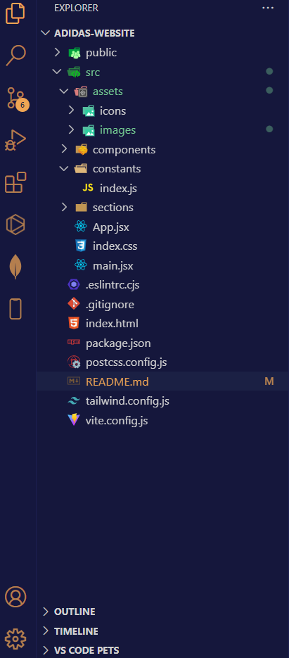
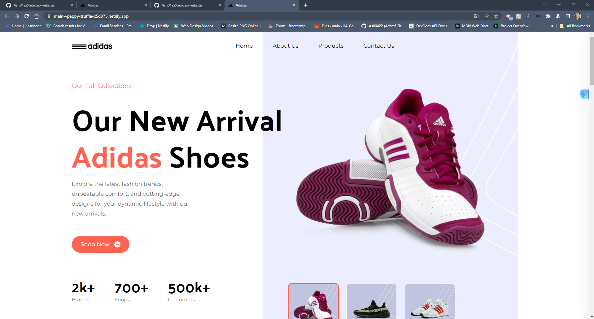
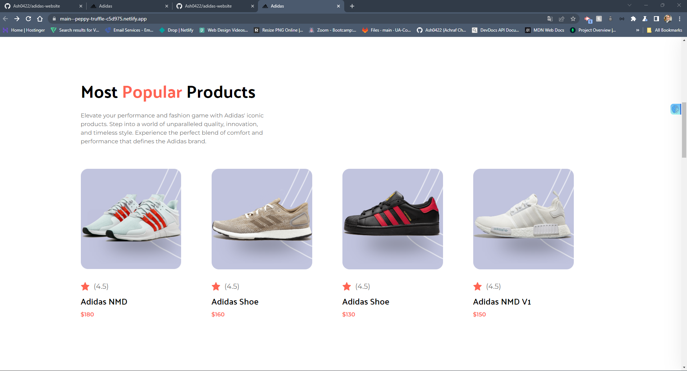
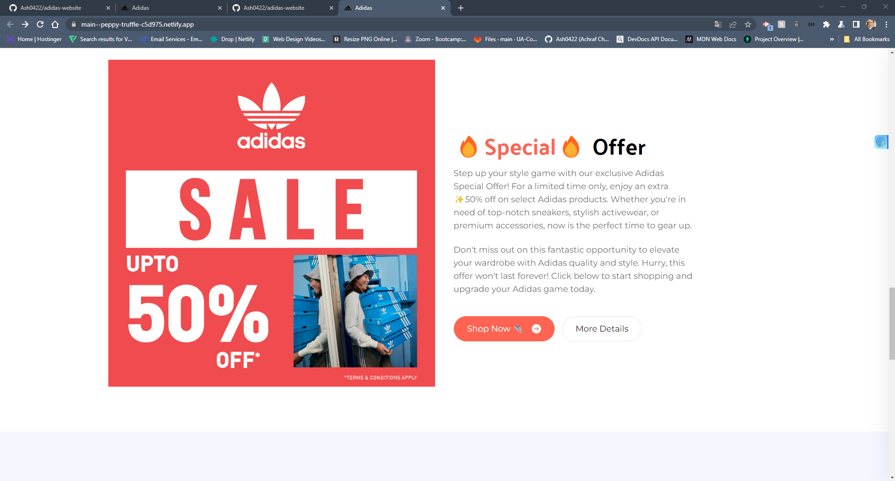
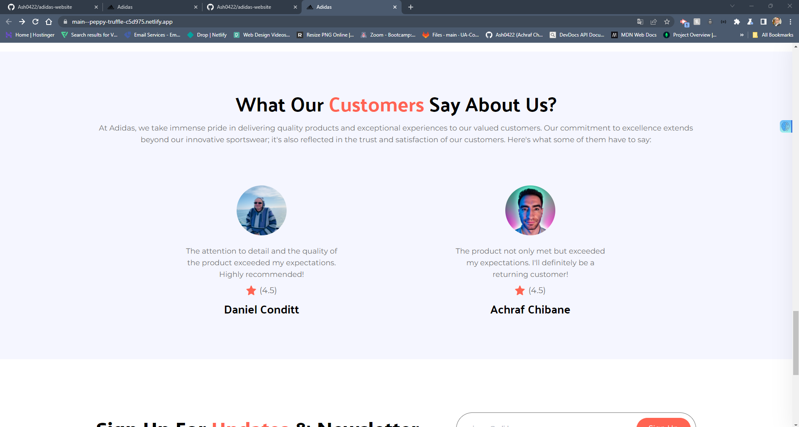
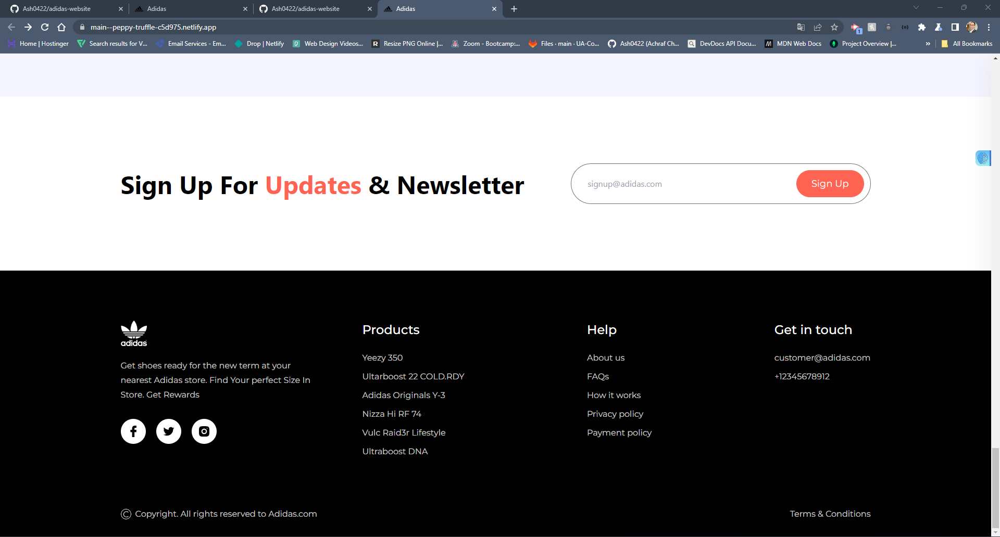

# adidas-website


## Table of Contents

- [Description](#description)
- [Screenshots](#screenshots)
- [Installation](#installation)
- [Usage](#usage)
- [User Story](#user-story)
- [Disclaimer](#disclaimer)
- [Contributing](#contributing)
- [Tests](#tests)
- [Questions](#questions)


## Description

The Adidas website redesign aims to provide an immersive and user-friendly experience to customers who visit the site. It has been developed with a focus on responsive design to ensure that the website functions seamlessly on various devices, from desktop computers to smartphones and tablets.

## Screenshots
## Folder Structure <br>



## Screenshot of the Adidas Website :





## The following image shows  the Hero:


## The following image shows the Most Popular Items : 


## The following image shows The Special Offer :  


## The following image shows the What Our Customer say about Us? : 


## The following image shows the Footer : 



## Installation
To run this website locally, follow these steps: <br>
1- Clone the repository to your local machine:
~~~
git@github.com:Ash0422/adidas-website.git
~~~
 
2- Navigate to the project directory: 
~~~
cd adidas-website
~~~ 

3- Install the project dependencies: <br>
~~~
npm install
~~~

4-Start the development server: <br>
~~~
npm run dev
~~~
or just check the Adidas Website on this link:   [Adidas-website](https://main--peppy-truffle-c5d975.netlify.app/)

## Usage

Feel free to explore the website and provide feedback on its design and functionality. You can also contribute to the project by submitting bug reports or feature requests in the Issues section.


## User Story
```
This is a redesign of the Adidas website, showcasing a fully responsive and modern web development approach. 
The goal of this project is to create an engaging online experience for customers, regardless of the device they're using.
```
## Disclaimer
```
This is a fictitious project and not affiliated with Adidas in any way. 
This README serves as an example for educational purposes and does not represent an actual Adidas 
```
## Contributing

Pull requests are welcome, please open an issue first to discuss what you would like to change. thank you

## Tests
The Adidas website has been tested by the creator and it works fine.<br>
this application has been uploaded to github:  [Adidas website GitHub](https://github.com/Ash0422/adidas-website)<br>
this application has been deployed to Netlify:  [Adidas website Netlify](https://main--peppy-truffle-c5d975.netlify.app/)


## Questions
For any additional questions, please contact me by [Achraf's EMAIL](chibane.tkd04@gmail.com) . or visit my GitHub profile at [Achraf's GITHUB](https://github.com/Ash0422) .